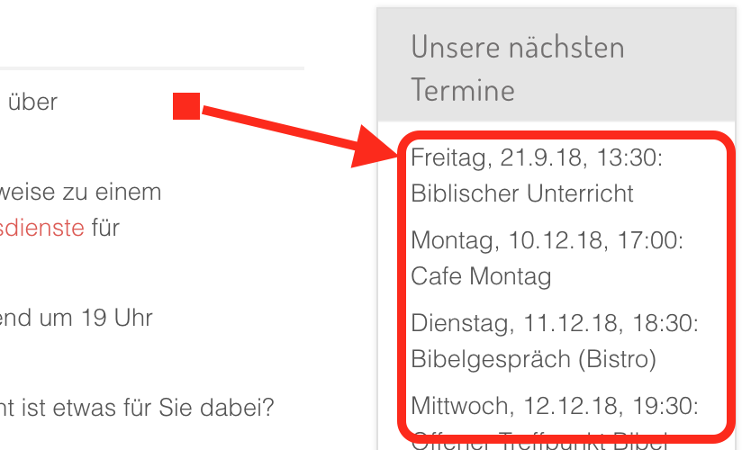

# What is Joomla! ChurchCal?

ChurchCal for [Joomla 3 or 4](https://www.joomla.org){:target="_blank"} is a Joomla! module that retrieves calendar entries from [ChurchTools](https://www.church.tools/en/home){:target="_blank"} calendars, using the [ChurchTools API](https://api.church.tools){:target="_blank"}, and displays them in a Joomla! module as a list of sorted calendar entries.

{ .off-glb }

Joomla! Churchcal is not using any `iframe` and it does not display a classical calendar view, nor does it provide any functionality to edit the ChurchCal calendar. It simply displays a list of calendar entries.

## Features

Joomla! ChurchCal

- retrieves calendar entries from one or more ChurchTools calendars, using the ChurchTools API,
- and displays them either in ascending or descending order as a list on a webpage, showing
- the weekday (Monday, Tuesday, etc.) - optionally -,
- the date and the start time, formatted according to the PHP date function,
- the end time - optionally -,
- and the description of the calendar entry.

## Known Issues

[These issues](https://github.com/UlricusR/joomla-churchcal/issues){:target="_blank"} are known to me. Should you stumble over a new issue, please submit it via the same link.

However, I do not futher develop ChurchCal.

## Contribute

If you want to take over and further develop ChurchCal for Joomla, you're welcome! It's all Open Source and on [GitHub](https://github.com/UlricusR/joomla-churchcal){:target="_blank"}.

Otherwise, just buy me a coffee - appreciated!

[{ .off-glb }](https://www.buymeacoffee.com/ulricus){:target="_blank"}
[{ .off-glb }](https://www.buymeacoffee.com/ulricus){:target="_blank"}
