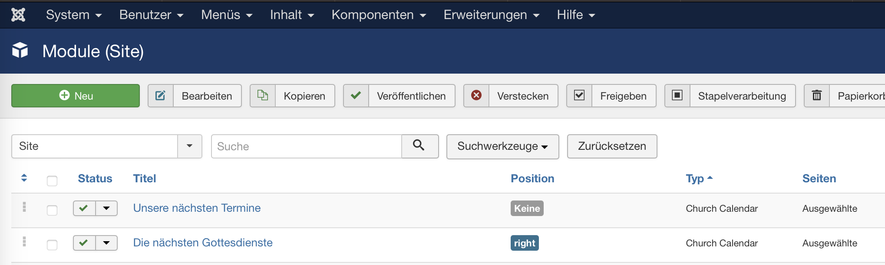

# Gebrauch

Das Modul kann entweder in einer von Ihrem Template vorgegebenen Position eingebunden werden oder frei im Inhalt eines Artikels positioniert werden.

{ .off-glb }

Für eine vorgegebene Template-Position wählen Sie die Position in der Liste der verfügbaren Positionen und über den Reiter "Menüzuweisung" die Seiten, auf denen das Modul eingebunden werden soll.

Für eine freie Positionierung geben Sie in der Positions-Box Ihre eigene Bezeichnung ein (z.B. "next_events") und binden Sie die Terminliste im Artikel dann über den Befehl `{loadposition next_events}` an beliebiger Stelle ein. In diesem Fall empfiehlt es sich, im Reiter "Menüzuweisung" alle Seiten auszuwählen.
